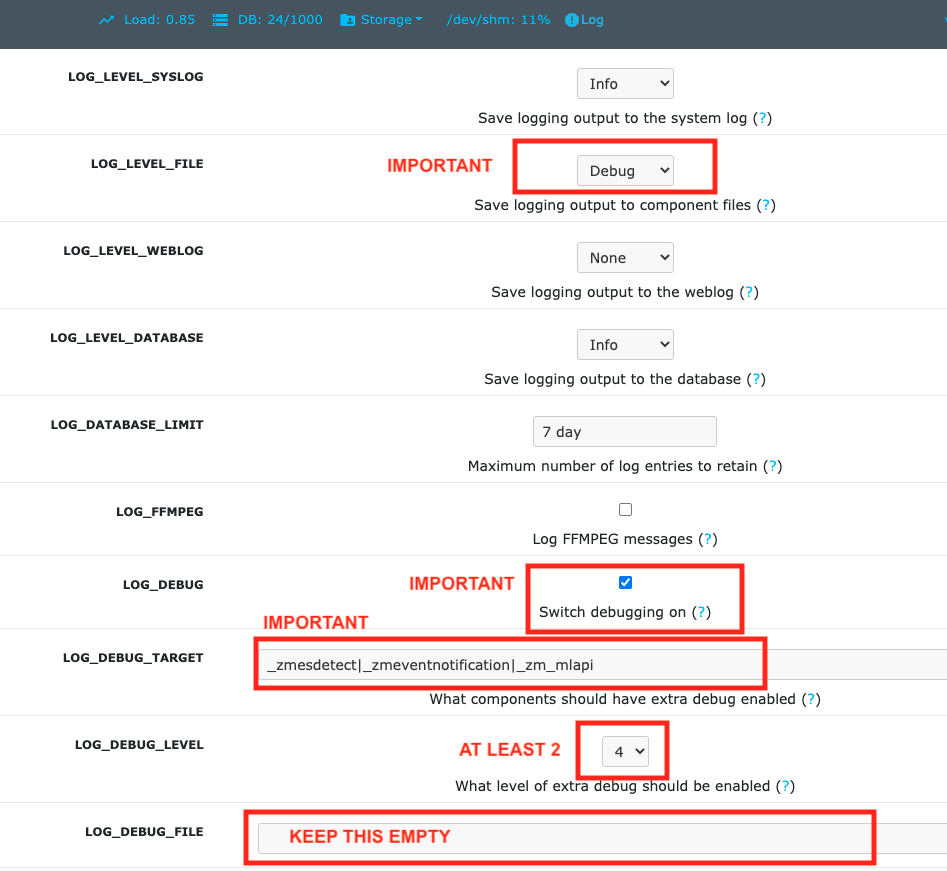

Event Notification Server FAQ
===============================

Machine Learning! Mmm..Machine Learning!
----------------------------------------

Easy. You will first have to read this document to correctly install
this server along with zoneminder. Once it works well, you can explore
how to enable Machine Learning based object detection that can be used
along with ZoneMinder alarms. If you already have this server figured
out, you can skip directly to the machine learning part (:doc:`hooks`)

If you have questions on the machine learning part, see :doc:`hooks_faq`

What is it?
-----------

A WSS (Secure Web Sockets) and/or MQTT based event notification server
that broadcasts new events to any authenticated listeners. (As of 0.6,
it also includes a non secure websocket option, if that's how you want
to run it)

Why do we need it?
------------------

-  The only way ZoneMinder sends out event notifications via event
   filters - this is too slow
-  People developing extensions to work with ZoneMinder for Home
   Automation needs will benefit from a clean interface
-  Receivers don't poll. They keep a web socket open and when there are
   events, they get a notification
-  Supports WebSockets, MQTT and Apple/Android push notification
   transports
-  Offers an authentication layer
-  Allows you to integrate custom hooks that can decide if an alarm
   needs to be sent out or not (an example of how this can be used for
   person detection is provided)

Is this officially developed by ZM developers?
----------------------------------------------

No. I developed it for zmNinja, but you can use it with your own
consumer.

How can I use this with Node-Red or Home Assistant?
---------------------------------------------------

As of version 1.1, the event server also supports MQTT (Contributed by
`@vajonam <https://github.com/vajonam>`__). zmeventnotification server can
be configured to broadcast on a topic called
``/zoneminder/<monitor-id>`` which can then be consumed by Home
Assistant or Node-Red.

To enable this, set ``enable = 1`` under the ``[mqtt]`` section and
specify the ``server`` to broadcast to.

You will also need to install the following module for this work

::

    perl -MCPAN -e "install Net::MQTT::Simple"
    
The MQTT::Simple module is known to work only with Mosquitto as of 10 Jun 2019.  It does not work correctly with the RabbitMQ MQTT plugin.  The easiest workaround if you have an unsupported MQTT system is to install Mosquitto on the Zoneminder system itself and bridge that to RabbitMQ.  You can bind Mosquitto to 127.0.0.1 and disable authentication to keep it simple. The eventserver.pl is then configured to send events to the local Mosquitto.  This is an example known working bridge set up (on Ubuntu, for example, this is put into /etc/mosquitto/conf.d/local.conf):

::

  bind_address 127.0.0.1
  allow_anonymous true
  connection bridge-zm2things
  address 10.10.1.20:1883
  bridge_protocol_version mqttv311
  remote_clientid bridge-zm2things
  remote_username zm
  remote_password my_mqtt_zm_password
  try_private false
  topic # out 0

Set the address, remote_username and remote_password for Mosquitto to use on the RabbitMQ.  Note that this is a one way bridge, so there is only a topic # out 0.  try_private false is needed to avoid a similar error to using MQTT::Simple.  

Disabling security
------------------

While I don't recommend either, several users seem to be interested in
the following

-  To run the eventserver on Websockets and not Secure Websockets, use
   ``enable = 0`` in the ``[ssl]`` section of the configuration file.
-  To disable ZM Auth checking (be careful, anyone can get all your data
   INCLUDING passwords for ZoneMinder monitors if you open it up to the
   Internet) use ``enable = 0`` in the ``[auth]`` section of the
   configuration file.

.. _upgrade_es_hooks:

How do I safely upgrade zmeventnotification to new versions?
------------------------------------------------------------

STEP 1: get the latest code
~~~~~~~~~~~~~~~~~~~~~~~~~~~

Download the latest version & change dir to it:

::

  git clone https://github.com/pliablepixels/zmeventnotification.git
  cd zmeventnotification/

STEP 2: stop the current ES
~~~~~~~~~~~~~~~~~~~~~~~~~~~~

::

    sudo zmdc.pl stop zmeventnotification.pl

STEP 3: Make a backup of your config files
~~~~~~~~~~~~~~~~~~~~~~~~~~~~~~~~~~~~~~~~~~~

Before you execute the next step you may want to create a backup of your existing ``zmeventnotification.ini`` and ``objectconfig.ini`` config files. The script will prompt you to overwrite. If you say 'Y' then your old configs will be overwritten. Note that old configs are backed up using suffixes like ``~1``, ``~2`` etc. but it is always good to backup on your own.

STEP 4: Execute the install script
~~~~~~~~~~~~~~~~~~~~~~~~~~~~~~~~~~~

**NOTE** : By default ``install.sh`` moves the ES script to ``/usr/bin``. 
If your ZM install is elsewhere, like ``/usr/local/bin`` please modify the ``TARGET_BIN`` variable in ``install.sh`` before executing it.

::

  sudo -H ./install.sh

Follow prompts. Note that just copying the ES perl file to ``/usr/bin`` is not sufficient. You also have to install the updated machine learning hook files if you are using them. That is why ``install.sh`` is better. If you are updating, make sure not to overwrite your config files (but please read breaking changes to see if any config files have changed). Note that the install script makes a backup of your old config files using ``~n`` suffixes where ``n`` is the backup number. However, never hurts to make your own backup first. 

Note that you can also automate updates like so:

::

  sudo -H ./install.sh --install-hook --install-es --no-install-config --no-interactive

The above will install/update the hooks, install/update the ES server but will not overwrite your existing config files. **NOTE** that newer versions of the ES/detection scripts may introduce new parameters in ``zmeventnotification.ini`` and ``objectconfig.ini``. You may need to paste them in manually, so always read :doc:`breaking`

STEP 5: Start the new updated server
~~~~~~~~~~~~~~~~~~~~~~~~~~~~~~~~~~~~

::

    sudo zmdc.pl start zmeventnotification.pl

Make sure you look at the logs to make sure its started properly

Configuring the notification server
-----------------------------------

Understanding zmeventnotification configuration
~~~~~~~~~~~~~~~~~~~~~~~~~~~~~~~~~~~~~~~~~~~~~~~

Starting v1.0, `@synthead <https://github.com/synthead>`__ reworked the
configuration (brilliantly) as follows:

-  If you just run ``zmeventnotification.pl`` it will try and load
   ``/etc/zm/zmeventnotification.ini``. If it doesn't find it, it will
   use internal defaults
-  If you want to override this with another configuration file, use
   ``zmeventnotification.pl --config /path/to/your/config/filename.ini``.
-  Its always a good idea to validate you config settings. For example:

::

  sudo /usr/bin/zmeventnotification.pl --check-config

    
  Configuration (read /etc/zm/zmeventnotification.ini):

  Secrets file.......................... /etc/zm/secrets.ini
  Restart interval (secs)............... 172800

  Port ................................. 9000
  Address .............................. [::]
  Event check interval ................. 5
  Monitor reload interval .............. 300

  Auth enabled ......................... yes
  Auth timeout ......................... 20

  Use FCM .............................. yes
  FCM API key .......................... (defined)
  Token file ........................... /var/lib/zmeventnotification/push/tokens.txt

  Use MQTT ..............................no
  MQTT Server ...........................127.0.0.1
  MQTT Username .........................(undefined)
  MQTT Password .........................(undefined)

  SSL enabled .......................... yes
  SSL cert file ........................ /etc/myserver/fullchain.pem
  SSL key file ......................... /etc/myserver/privkey.pem

  Verbose .............................. no
  Read alarm cause ..................... yes
  Tag alarm event id ................... yes
  Use custom notification sound ........ no

  Hook Script on Event Start ........... '/var/lib/zmeventnotification/bin/zm_event_start.sh'
  Hook Script on Event End.............. '/var/lib/zmeventnotification/bin/zm_event_end.sh'

  Notify on Event Start (hook success).. all
  Notify on Event Start (hook fail)..... web
  Notify on Event End (hook success)... fcm,web
  Notify on Event End (hook fail)...... web

  Notify End only if Start success......yes

  Use Hook Description........... yes
  Keep frame match type.......... yes
  Skipped monitors............... (undefined)
  Store Frame in ZM...............yes

  Picture URL ................... https://myserver/zm/index.php?view=image&eid=EVENTID&fid=objdetect&width=600
  Include picture................ yes
  Picture username .............. zmes
  Picture password .............. (defined)

What is the hook section ?
~~~~~~~~~~~~~~~~~~~~~~~~~~

The ``hook`` section allows you to invoke a custom script when an alarm
is triggered by ZM.

``hook_script`` points to the script that is invoked when an alarm
occurs

If the script returns success (exit value of 0) then the notification
server will send out an alarm notification. If not, it will not send a
notification to its listeners. This is useful to implement any custom
logic you may want to perform that decides whether this event is worth
sending a notification for.

Related to ``hook`` we also have a ``hook_description`` attribute. When
set to 1, the text returned by the hook script will overwrite the alarm
text that is notified.

We also have a ``hook_skip_monitors`` attribute. This is a comma separated
list of monitors. When alarms occur in those monitors, hooks will not be
called and the ES will directly send out notifications (if enabled in
ES). This is useful when you don't want to invoke hooks for certain
monitors as they may be expensive (especially if you are doing object
detection)

Finally, ``keep_frame_match_type`` is really used when you enable
"bestmatch". It prefixes an ``[a]`` or ``[s]`` to tell you if object
detection succeeded in the alarmed or snapshot frame.

Here is an example: (Note: just an example, please don't ask me for
support for person detection)

-  You will find a sample ``zm_event_start.sh`` script in the ``hook``
   directory. This script is invoked by the notification server when an
   event starts.
-  This script in turn invokes a python OpenCV based script that grabs
   an image with maximum score from the current event so far and runs a
   fast person detection routine.
-  It returns the value "person detected" if a person is found and none
   if not
-  The wrapper script then checks for this value and exits with either 0
   (send alarm) or 1 (don't send alarm)
-  the notification server then sends out a ": person detected"
   notification to the clients listening

Those who want to know more: - Read the detailed notes
`here <https://github.com/pliablepixels/zmeventnotification/tree/master/hook>`__
- Read
`this <https://medium.com/zmninja/inside-the-hood-machine-learning-enhanced-real-time-alarms-with-zoneminder-e26c34fe354c>`__
for an explanation of how this works

Troubleshooting common situations
---------------------------------

The ES randomly hangs
~~~~~~~~~~~~~~~~~~~~~~~

Short answer: Upgrade websocket library to 0.004000. You can do this by:

::

   sudo -H cpan 
   # and inside the cpan shell
   upgrade Net::WebSocket::Server
   # exit after that

**Explanation:** 

This is the reason why older versions of the websocket library would hang:
If you have exposed the ES port (typically 9000) to the internet, there are chances your ES may lock up.
The reason seems to be that that there are internet port scanners which establish a TCP connection that stays 
connected for a long time and does not upgrade to websockets. This causes the library which I use for the ES to 
handle websockets to lock up. The original issue can be viewed `here <https://github.com/topaz/perl-Net-WebSocket-Server/issues/6>`__.

If you want to disable censys, you can follow their instructions on their website to `opt-out <https://support.censys.io/hc/en-us/articles/360043177092-Opt-Out-of-Scanning>`__ 
In Linux/ubuntu, I use ufw (make sure it is enabled) as a front-end to iptables and the following commands do it:

::

   sudo ufw deny from 74.120.14.0/24 comment "Deny censys"
   sudo ufw deny from 162.142.125.0/24 comment "Deny censys"
   sudo ufw deny from 167.248.133.0/24 comment "Deny censys"
   sudo ufw deny from 192.35.168.0/23 comment "Deny censys"

Note that at least on Ubuntu, ufw keeps getting disabled when I reboot, even after I enable it via systemctl.
To fix that I had to add ``After=netfilter-persistent.service`` inside the ``[Unit]`` block of ``/lib/systemd/system/ufw.service``

I can't connect to the ES
~~~~~~~~~~~~~~~~~~~~~~~~~~~
There could be multiple reasons:

- If you are connecting from WAN make sure you have set up port forwarding as needed
- Try changing the ``address`` attribute in ``[network]`` section of ``zmeventnotification.ini``.
  If you don't have your IP specified, it will use ``[::]``. Try ``0.0.0.0`` instead.

I just added a new monitor and the ES is not sending notifications for it
~~~~~~~~~~~~~~~~~~~~~~~~~~~~~~~~~~~~~~~~~~~~~~~~~~~~~~~~~~~~~~~~~~~~~~~~~~

This generally happens if you add a monitor _after_ you configure the ES.
What you need to do is go to zmNinja's ``Menu->Settings->Event Server`` option and enable the monitor you just added and press save.

The ES is missing events. I see them being triggered in ZM
~~~~~~~~~~~~~~~~~~~~~~~~~~~~~~~~~~~~~~~~~~~~~~~~~~~~~~~~~~~
There could be multiple issues:

- Let's start with the most obvious one. The ES and ZM need to be running on the same server
- Alarms are only triggered on Mocord, Modect and Nocord monitors 
- If you changed monitor modes or added new monitors after the ES started running, restart the ES so it loads the latest information
- The ES polls ZM every 5 seconds for new alarms (the duration is controlled by ``event_check_interval`` in ``zmeventnotification.ini``). This means that if your alarm is very brief, that is, it starts and ends before the ES polls for new events then it will be missed. Note that the ES will catch alarms both in ``ALARM`` and ``ALERT`` state. ``ALARM`` is when ZM is actually detecting motion in the event. ``ALERT`` is when ZM stops detecting motion but is still waiting around till it writes all your ``post event frames`` that you have configured on your ZM Monitor buffer settings. So here is an example: Let's say I have a "Garage" monitor that I've configured a post event buffer of 100 (frames) and I've set my camera FPS to 10. That means it will take ZM 10 seconds to close an event after my alarm occurs (it will be in ``ALERT`` stage all that time). In this case, no matter show short my actual alarm, the ES will always catch it.

LetsEncrypt certificates cannot be found when running as a web user
~~~~~~~~~~~~~~~~~~~~~~~~~~~~~~~~~~~~~~~~~~~~~~~~~~~~~~~~~~~~~~~~~~~
When the notification server is run in web user mode (example ``sudo -u www-data``), the event notification
server complains that it cannot find the certificate. The error is something like this:

::

        zmeventnotification[10090].ERR [main:547] [Failed starting server: SSL_cert_file /etc/letsencrypt/live/mysite.net-0001/fullchain.pem does not exist at /usr/share/perl5/vendor_perl/IO/Socket/SSL.pm line 402.]
        
The problem is read permissions, starting at the root level. Typically doing ``chown -R www-data:www-data /etc/letsencrypt`` solves this issue

Picture notifications don't show images
~~~~~~~~~~~~~~~~~~~~~~~~~~~~~~~~~~~~~~~

Before you read this, make sure push notifications in general are working (without images). To get images working, 
the following conditions must be met:

- You must use HTTPS
- There is a 1MB limit to image size
- You can't use self signed certs 
- The IP/hostname needs to be accessible by zmNinja on the mobile device you are receiving pushes on
- You need ZM 1.32.3 or above
- A good way to isolate if its a URL problem or something else is replace the ``picture_url`` in ``/etc/zm/secrets.ini`` 
  with a knows HTTPS url like `this <https://upload.wikimedia.org/wikipedia/commons/thumb/8/8d/A_small_bird.jpg/800px-A_small_bird.jpg>`__
  Note that when you use a test image, comment out ``picture_portal_username`` and
  ``picture_portal_password`` so they are not auto appended. Remember to restart the ES.
- Once you have a public URL working as above, look at your ES DEBUG logs (not INF). When a push is beint sent out, you will 
  notice a message like so:

  ::

      [|----> FORK:Driveway (7), eid:9666 fcmv1: Final JSON using FCMV1 being sent is: {"title":"Driveway Alarm (9666)","image_url":"https://myserver:port/zm/index.php?view=image&eid=9666&fid=objdetect&width=600&username=admin&password=xxx}, <etc>

  Take the URL inside ``image_url`` and replace the password with the actual password and paste it in your mobile device. If it works (without requiring to manually login), only then will push images show

Before you report issues, please make sure you have been diligent in
testing - Try with a public URL as indicated above. This is important. -
In your issue, post debug logs of zmeventnotification so I can see what
message it is sending

Secure mode just doesn't work (WSS) - WS works
~~~~~~~~~~~~~~~~~~~~~~~~~~~~~~~~~~~~~~~~~~~~~~

Try to put in your event server IP in the ``address`` token in
``[network]`` section of ``zmeventnotification.ini``

I'm not receiving push notifications in zmNinja
~~~~~~~~~~~~~~~~~~~~~~~~~~~~~~~~~~~~~~~~~~~~~~~

This almost always happens when zmNinja is not able to reach the server.
Before you contact me, please perform the following steps and send me
the output:

1. Stop the event server. ``sudo zmdc.pl stop zmeventnotification.pl``
2. Do a ``ps -aef | grep zmevent`` and make sure no stale processes are
   running
3. Edit your ``/etc/zm/zmeventnotification.ini`` and make sure
   ``console_logs = yes`` to get console debug logs
4. Run the server manually by doing
   ``sudo -u www-data /usr/bin/zmeventnotification.pl --debug`` (replace with
   ``www-data`` with ``apache`` depending on your OS)
5. You should now see logs on the commandline like so that shows the
   server is running:

::

    018-12-20,08:31:32 About to start listening to socket
    12/20/2018 08:31:32.606198 zmeventnotification[12460].INF [main:582] [About to start listening to socket]
    2018-12-20,08:31:32 Secure WS(WSS) is enabled...
    12/20/2018 08:31:32.656834 zmeventnotification[12460].INF [main:582] [Secure WS(WSS) is enabled...]
    2018-12-20,08:31:32 Web Socket Event Server listening on port 9000
    12/20/2018 08:31:32.696406 zmeventnotification[12460].INF [main:582] [Web Socket Event Server listening on port 9000]

6. Now start zmNinja. You should see event server logs like this:

::

    2018-12-20,08:32:43 Raw incoming message: {"event":"push","data":{"type":"token","platform":"ios","token":"cVuLzCBsEn4:APA91bHYuO3hVJqTIMsm0IRNQEYAUa<deleted>GYBwNdwRfKyZV0","monlist":"1,2,4,5,6,7,11","intlist":"45,60,0,0,0,45,45","state":"enabled"}}

If you don't see these logs on the event server, zmNinja is not able to
connect to the event server. This may be because of several reasons: 

* Your event server IP/DNS is not reachable from your phone 

* If you are using SSL, your certificates are invalid (try disabling SSL first - both 
  on the event server and on zmNinja)

* Your zmNinja configuration is wrong (the most common error I see is the server has 
  SSL disabled, but  zmNinja is configured to use ``wss://`` instead of ``ws://``)

7. Assuming the above worked, go to zmNinja logs in the app. Somewhere
   in the logs, you should see a line similar to:

::

    Dec 20, 2018 05:50:41 AM DEBUG Real-time event: {"type":"","version":"2.4","status":"Success","reason":"","event":"auth"}

This indicates that the event server successfully authenticated the app.
If you see step 6 work but not step 7, you might have provided incorrect
credentials (and in that case, you'll see an error message)

8.  Finally, after all of the above succeeds, do a
    ``cat /var/lib/zmeventnotification/push/tokens.txt`` to make sure
    the device token that zmNinja sent is stored (desktop apps don't
    have a device token). If you are using zmNinja on a mobile app, and
    you don't see an entry in ``tokens.txt`` you have a problem. Debug.

9.  *Always* send me logs of both zmNinja and zmeventnotification - I
    need them to understand what is going on. Don't send me one line.
    You may think you are sending what is relevant, but you are not. One
    line logs are mostly useless.

10. Some other notes:

-  If you are not using machine learning hooks, make sure you comment
   out the ``hook_script`` line in ``[hook]``. If you have not setup
   the scripts correctly, if will fail and not send a push.

-  If you don't see an entry in ``tokens.txt`` (typically in
   ``/var/lib/zmeventnotification/push``) then your phone is not
   registered to get push. Kill zmNinja, start the app, make sure the
   event server receives the registration and check ``tokens.txt``

-  Sometimes, Google's FCM server goes down, or Apple's APNS server goes
   down for a while. Things automagically work in 24 hrs.

-  Kill the app. Then empty the contents of ``tokens.txt`` in the event
   server (don't delete it). Then restart the event server. Start the
   app again. If you don't see a new registration token, you have a
   connection problem

-  I'd strongly recommend you run the event server in "manual mode" and
   stop daemon mode while debugging.

I'm getting multiple notifications for the same event
~~~~~~~~~~~~~~~~~~~~~~~~~~~~~~~~~~~~~~~~~~~~~~~~~~~~~

Some possibilities:

- Most often, its because you have multiple copies of the eventserver
  running and you don't know it. Maybe you were manually testing it, and
  forgot to quit it and terminated the window. Do
  ``sudo zmdc.pl stop zmeventnotification.pl`` and then
  ``ps -aef | grep zme``, kill everything, and start again. Monitor the
  logs to see how many times a message is sent out.

- There are situations where you device token has changed and ``/var/lib/zmeventnotification/push/tokens.txt`` has 
  both the old and new token and both work. In this case, your device will get multiple 
  notifications. Stop the ES, delete ``tokens.txt`` and let zmNinja re-register 

- At times Google's FCM servers send out multiple
  notifications. Why? I don't know. But it sorts itself out very quickly,
  and if you think this must be the reason, I'll wager that you are
  actually in the 99.9% lot and haven't checked properly.

How do I reduce the time of delay from an alarm occurring in ZM to the notification being sent out?
~~~~~~~~~~~~~~~~~~~~~~~~~~~~~~~~~~~~~~~~~~~~~~~~~~~~~~~~~~~~~~~~~~~~~~~~~~~~~~~~~~~~~~~~~~~~~~~~~~~
- First, turn on debug logs. You'll know where the delays are occurring and then you can deep dive.
- Read the priniciples document: :ref:`from-detection-to-notification`. Really, it will help you understand how this works 
- There are some key areas you can optimize for:

   - The ES _polls_ ZoneMinder mapped memory for events. By default it is 5 seconds. To change it, 
     change ``event_check_interval`` in ``zm_eventnotification.ini`` 

   - One an alarm is detected, depending on whether you configured hooks or not, it will invoke 
     object detection. Based on your server/desktop configuration, this can take just a few milliseconds 
     to several seconds. If you are using machine learning hooks, consider using `mlapi <https://github.com/pliablepixels/mlapi>`__
     as it preloads models into memory only once. Loading a model can take a few seconds, while detection, if you are on 
     a GPU or TPU takes milliseconds. If you don't use hooks, turn it off in config.

   - Again, if you are using hooks, there is a ``wait`` attribute in ``objectconfig.ini`` that waits for 
     a few seconds before downloading the image from ZM. This was done because sometimes the ES may be asking 
     to download an image that ZM hasn't written to disk yet (remember, ES is triggered when an alarm starts).
     This is really no longer needed, if you are using it. Starting ES 6.1.0, you can instead just use the 
     `much more powerful  `stream_sequence <https://pyzm.readthedocs.io/en/latest/source/pyzm.html#pyzm.ml.detect_sequence.DetectSequence.detect_stream>`__ 
     construct to specify retries.

This is really what comes to mind. If you are seeing unusual delays, please create a github issue and post 
debug logs (again, NOT info logs please) 

Push notifications are delayed by several minutes when the phone turns off (Android)
~~~~~~~~~~~~~~~~~~~~~~~~~~~~~~~~~~~~~~~~~~~~~~~~~~~~~~~~~~~~~~~~~~~~~~~~~~~~~~~~~~~~~~~~~

There seems to be multiple potential reasons:

- Starting Android 6, a doze mode and battery optimization mode has been introduced which aggressively tries to 
  put the phone into low power mode. This results in the apps disconnecting from FCM servers for around 10-15 mins
  at a stretch, which may explain why you get delayed notifications. To avoid this, remove zmNinja from any battery
  optimization and doze mode effects. There are instructions `here <https://documentation.onesignal.com/docs/notifications-show-successful-but-are-not-being-shown>`__
  on how to do that (scroll to the middle of the page and see the table that describes what to do depending on your phone manufacturer).

- The ES delivers messages using ``high`` priority in Android.  However, it looks like google _may_ `deprioritize <https://stackoverflow.com/questions/53646761/firebase-push-notification-delay-after-triggering-few-high-priority-notification>__`
  them if we send too many high priority messages. So try setting your ``fcm_android_priority`` to ``normal`` if you see this issue. However, 
  if you set it to normal, messages may be delayed if you are in doze mode.

- Finally, experiment with setting ``fcm_android_ttl`` to ``0`` along with ``fcm_android_priority`` to ``high`` 

- If nothing else works, set `use_fcmv1` to `no` in `zmeventnotification.ini` to go back to legacy 
  protocol 

- Finally, it is entirely possible there is some magic-foo of combination of attributes in FCMv1 which
  is not documented that may do the right thing. If you figure it out, please let me know.

- If you are wondering what this all means for iOS - it is unaffected. iOS uses a priority 10 by default (high) 
  that delivers the notification instantly.

The server runs fine when manually executed, but fails when run in daemon mode (started by zmdc.pl)
~~~~~~~~~~~~~~~~~~~~~~~~~~~~~~~~~~~~~~~~~~~~~~~~~~~~~~~~~~~~~~~~~~~~~~~~~~~~~~~~~~~~~~~~~~~~~~~~~~~

(This only covers daemon mode of the ES server. If you are facing issues related to hooks running
in daemon model, please see :doc:`hooks_faq`)

-  Make sure the file where you store tokens
   (``/var/lib/zmeventnotification/push/tokens.txt or whatever you have used``)
   is not RW Root only. It needs to be RW ``www-data`` for Ubuntu/Debian
   or ``apache`` for Fedora/CentOS. You also need to make sure the
   directory is accessible. Something like
   ``chown -R www-data:www-data /var/lib/zmeventnotification/push``

-  Make sure your certificates are readable by ``www-data`` for
   Ubuntu/Debian, or ``apache`` for Fedora/CentOS (thanks to
   `@jagee <https://github.com/pliablepixels/zmeventnotification/issues/8>`_).
-  Make sure the *path* to the certificates are readable by ``www-data``
   for Ubuntu/Debian, or ``apache`` for Fedora/CentOS

When you run zmeventnotifiation.pl manually, you get an error saying 'port already in use' or 'cannot bind to port' or something like that
~~~~~~~~~~~~~~~~~~~~~~~~~~~~~~~~~~~~~~~~~~~~~~~~~~~~~~~~~~~~~~~~~~~~~~~~~~~~~~~~~~~~~~~~~~~~~~~~~~~~~~~~~~~~~~~~~~~~~~~~~~~~~~~~~~~~~~~~~~

The chances are very high that you have another copy of
``zmeventnotification.pl`` running. You might have run it in daemon
mode. Try ``sudo zmdc.pl stop zmeventnotification.pl``. Also do
``ps -aef | grep zmeventnotification`` to check if another copy is not
running and if you do find one running, you'll have to kill it before
you can start it from command line again.

Running hooks manually detects the objects I want but fails to detect via ES (daemon mode)
~~~~~~~~~~~~~~~~~~~~~~~~~~~~~~~~~~~~~~~~~~~~~~~~~~~~~~~~~~~~~~~~~~~~~~~~~~~~~~~~~~~~~~~~~~~~

There may be multiple reasons, but a common one is of timing. When the ES invokes the hook, it is invoked almost immediately upon event detection. In some cases, ZoneMinder still has not had time to create an alarmed frame, or the right snapshot frame. So what happens is that when the ES invokes the hook, it runs detection on a different image from the one you run later when invoked manually. Try adding a ``wait = 5`` to ``objectconfig.ini`` to that monitor section and see if it helps

Great Krypton! I just upgraded ZoneMinder and I'm not getting push anymore!
~~~~~~~~~~~~~~~~~~~~~~~~~~~~~~~~~~~~~~~~~~~~~~~~~~~~~~~~~~~~~~~~~~~~~~~~~~~

Make sure your eventserver is running:
``sudo zmdc.pl status zmeventnotification.pl``

How do I disable secure (WSS) mode?
-----------------------------------

As it turns out many folks run ZM inside the LAN only and don't want to
deal with certificates. Fair enough. For that situation, edit
zmeventnotification.pl and use ``enable = 0`` in the ``[ssl]`` section
of the configuration file. **Remember to ensure that your EventServer
URL in zmNinja does NOT use wss too - change it to ws**. Also remember to
restart the ES after this change.

.. _es-hooks-logging:

Logging
~~~~~~~~~

Setting up logging in both ES and detection (if you use them) is critical to be able to diagnose issues. Here is what I do:

This gives you a summary of what you need to do:

- In ``ZM->Options->Logs:``

  - LOG_DEBUG is on
  - LOG_LEVEL_FILE = debug
  - LOG_LEVEL_SYSLOG = Info
  - LOG_LEVEL_DATABASE = Info
  - LOG_DEBUG_TARGET = ``_zmesdetect|_zmeventnotification``. This enables DEBUG logs for both detection and event server scripts. Iff you have other targets, just separate them with ``|`` - example, ``_zmc|_zmesdetect``. If you only want to track detection logs and not ES logs, just do  ``_zmesdetect``. You can also enable debug logs for just one monitor's hooks like so: ``_zmesdetect_m5|_zmeventnotification``. This will enable debug logs only when hooks are run for monitor 5. Just remember this: "detection logs" only deal with detecting objects. The ES logs will tell you whether the detection text was received properly, whether it was written to ZM DB properly and whether it was sent out in a notification.

  The above config. will store debug logs in my ``/var/log/zm`` directory, while Info level logs will be recorded in syslog and DB.

  You will likely need to restart ZM after this.

  So now, to view hooks/detect logs, all I do is:

  ::

    tail -F  /var/log/zm/zmesdetect*.log 

  To view ES + hooks/detect logs:

  ::

    tail -F  /var/log/zm/zmesdetect*.log /var/log/zm/zmeventnotification.log

  Note that the detection code registers itself as ``zmesdetect`` with ZM. When it is invoked with a specific monitor ID (usually the case), then the component is named ``zmesdetect_mX.log`` where ``X`` is the monitor ID. In other words, that now gives you one log per monitor (just like ``/var/log/zm/zmc_mX.log``) which makes it easy to debug/isolate. Also note we are doing ``tail -F`` not ``tail -f``. ``-F`` tracks files as they get logrotated as well.

.. _debug_reporting_es:

Debugging and reporting problems
--------------------------------

STOP. Before you shoot me an email, **please** make sure you have read
the `common problems <#troubleshooting-common-situations>`__ and have
followed *every step* of the `install guide <#how-do-i-install-it>`__
and in sequence. I can't emphasize how important it is to be diligent.

STOP (redux): Please don't send me emails without relevant logs (unless of course, it is to do with situations where, say, zmNinja doesn't load and you can't extract logs). Read :ref:`es-hooks-logging`.

Here is how to debug and report:

**If your problem involves zmNinja:**

-  Enable Debug logs in zmNinja (Setting->Developer Options->Enable
   Debug Log), if zmNinja is part of the problem

- Clear zmNinja logs and then replicate the issue. Send me zmNinja logs right after that. That way it is easier for me to zero in to what the problem may be. If you send me a whole bunch of logs, unrelated to your issue, I'll likely not know what is going on.

**If your problem involves the ES and/or the hooks:**

- Enable ZM debug logs for both ES (and hooks if you use them) as described in :ref:`es-hooks-logging`. Note that ES debug logs are different from hooks debug logs. You need to enable both if you use them. 

**When you send ES/detection logs:**

::

  03/19/20 06:45:03 zmesdetect_m2[21409] INF zm_detect.py:160 [---------| hook version: 5.10.1, ES version: 5.10 |------------]

This shows my ES version is ``5.10`` and hooks version  is ``5.10.1``, which is good. If you saw ``5.9.4`` and ``5.10``, for example, we have a problem. Upgrade again and please upgrade both hooks and ES.

- Make sure you see ``DBG`` logs (Debug). If you only see ``INF`` logs, you haven't followed the instructions above to enable debug logs. Read :ref:`es-hooks-logging` again.
- Don't just send me a slice of what you think is relevant. Please don't think you know what to send me. Let me decide that. From your side, send me the full logs. By full logs, I mean:

  - If you think your detection is *not* working for an event, say eid=77985, send me *all* the ES logs starting from ``PARENT: New event 77985 reported for Monitor:<etc>`` to ``PARENT: Job: Deleting active_event eid:77985, mid:<etc>``. That is, everything from start to end of that event. Also send me *all* the detection logs. Let's say the monitor in question was Monitor Id:2. Then the detection logs will be in ``/var/log/zm/zmesdetect_m2.log``. Send me *all* the logs from the start to the finish for that event.

  - If you have issues starting the ES, send me *all* logs starting from when the ES starts after you do a ``sudo zmdc.pl restart  zmeventnotification.pl``

To get DEBUG logs:

**Option 1 (Easy):**

-  Stop ES if it is running as a daemon (``sudo zmdc.pl stop zmeventnotification.pl``)
-  Start a terminal and start zmeventnotification manually from
   command line like so ``sudo -u www-data /usr/bin/zmeventnotification.pl --debug``
- This will print debug logs on the terminal
- Note that this will NOT print debug logs for hooks, so if you feel the problem is with hooks, see :ref:`this section <debug_reporting_hooks>`

**Option 2 (More comprehensive): Enable ZM logs**

- Follow steps :ref:`here <es-hooks-logging>`
- It is _very_ important to make sure you follow _all_ the steps or you won't see logs
- When you set up debug logging via ZM, you will see debug logs from both ES and hooks in different files like so:

::

  pp@homeserver:~/fiddle/zmeventnotification$ tail -F /var/log/zm/zmeventnotification.log /var/log/zm/zmesdetect_m*.log
  ==> /var/log/zm/zmeventnotification.log <==
  10/06/2019 06:48:29.200008 zmeventnotification[13694].INF [main:557] [Invoking hook:'/var/lib/zmeventnotification/bin/zm_event_start.sh' 33989 2 "DoorBell" " front" "/var/cache/zoneminder/events/2/2019-10-06/33989"]
  10/06/2019 06:48:34.013490 zmeventnotification[29913].INF [main:557] [New event 33990 reported for Monitor:10 (Name:FrontLawn)  front steps]
  10/06/2019 06:48:34.020958 zmeventnotification[13728].INF [main:557] [Forking process:13728 to handle 1 alarms]
  10/06/2019 06:48:34.021347 zmeventnotification[13728].INF [main:557] [processAlarms: EID:33990 Monitor:FrontLawn (id):10 cause: front steps]
  10/06/2019 06:48:34.237147 zmeventnotification[13728].INF [main:557] [Adding event path:/var/cache/zoneminder/events/10/2019-10-06/33990 to hook for image storage]
  10/06/2019 06:48:34.237418 zmeventnotification[13728].INF [main:557] [Invoking hook:'/var/lib/zmeventnotification/bin/zm_event_start.sh' 33990 10 "FrontLawn" " front steps" "/var/cache/zoneminder/events/10/2019-10-06/33990"]
  10/06/2019 06:48:46.529693 zmeventnotification[13728].INF [main:557] [For Monitor:10 event:33990, hook script returned with text: exit:1]
  10/06/2019 06:48:46.529896 zmeventnotification[13728].INF [main:557] [Ending process:13728 to handle alarms]
  10/06/2019 06:48:47.640414 zmeventnotification[13694].INF [main:557] [For Monitor:2 event:33989, hook script returned with text: exit:1]
  10/06/2019 06:48:47.640668 zmeventnotification[13694].INF [main:557] [Ending process:13694 to handle alarms]

  ==> /var/log/zm/zmesdetect_m10.log <==
  10/06/19 06:48:42 zmesdetect_m10[13732] DBG zm_detect.py:344 [No match found in /var/lib/zmeventnotification/images/33990-alarm.jpg using model:yolo]
  10/06/19 06:48:42 zmesdetect_m10[13732] DBG zm_detect.py:189 [Using model: yolo with /var/lib/zmeventnotification/images/33990-snapshot.jpg]
  10/06/19 06:48:46 zmesdetect_m10[13732] DBG zm_detect.py:194 [|--> model:yolo detection took: 3.541227s]

-  If you are debugging problems with receiving push notifications on
   zmNinja mobile, then replicate the following scenario:

  -  Run the event server in manual mode as described above
  -  Kill zmNinja
  -  Start zmNinja
  -  At this point, in the ``zmeventnotification`` logs you should registration messages (refer to logs example above). If you don't you've either not configured zmNinja to use the eventserver, or it can't reach the eventserver (very common problem)
  -  Next up, make sure you are not running zmNinja in the foreground (move it to background or kill it). When zmNinja is in the foreground, it uses websockets to get notifications
  -  Force an alarm like I described above. If you don't see logs in ``zmeventnotification`` saying "Sending notification over FCM" then the eventserver, for some reason, does not have your app token. Inspect ``tokens.txt`` (typically in ``/etc/zm/``) to make sure an entry for your phone exists
  -  If you see that message, but your mobile phone is not receiving a push notification:

    -  Make sure you haven't disable push notifications on your phone (lots of people do this by mistake and wonder why)
    -  Make sure you haven't muted notifications (again, lots of people...)
    -  Sometimes, the push servers of Apple and Google stop forwarding messages for a day or two. I have no idea why. Give it a day or two?
    -  Open up zmNinja, go right to logs and send it to me
    -  If you have issues, please send me a copy of your zmeventnotification logs generated above from Terminal-Log, as well as zmNinja debug logs

Brickbats
---------

**Why not just supply the username and password in the URL as a
resource? It's over TLS**

Yup its encrypted but it may show up in the history of a browser you
tried it from (if you are using a browser) Plus it may get passed along
from the source when accessing another URL via the Referral header

**So it's encrypted, but passing password is a bad idea. Why not some
token?**

-  Well, now that ZM supports login tokens (starting 1.33), I'll get to supporting it, eventually.

**Why WSS and not WS?**

Not secure. Easy to snoop. Updated: As of 0.6, I've also added a non
secure version - use ``enable = 0`` in the ``[ssl]`` section of the
configuration file. As it turns out many folks don't expose ZM to the
WAN and for that, I guess WS instead of WSS is ok.

**Why ZM auth in addition to WSS?**

WSS offers encryption. We also want to make sure connections are
authorized. Reusing ZM authentication credentials is the easiest. You
can change it to some other credential match (modify ``validateZM``
function)
